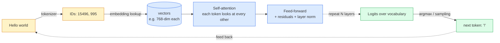
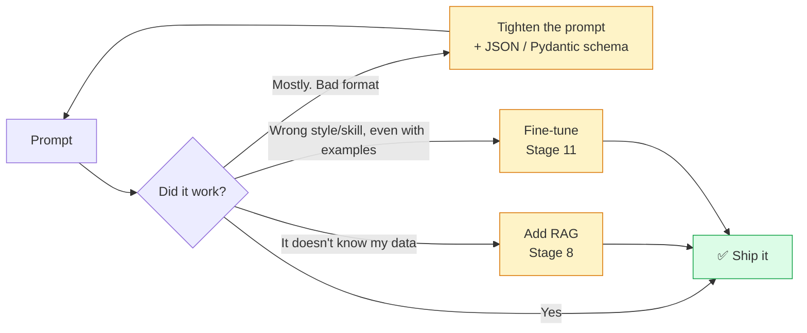
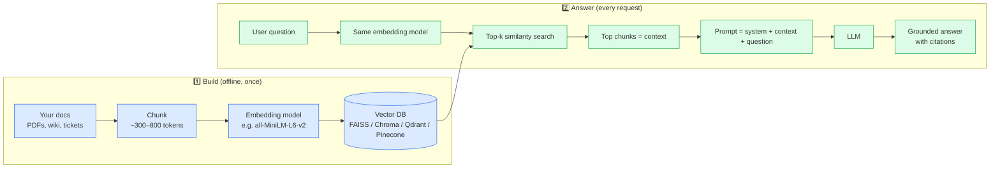
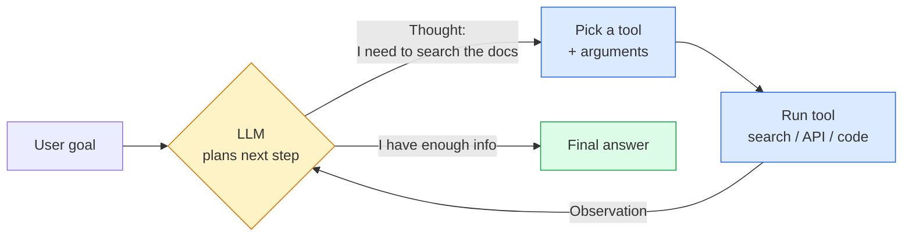
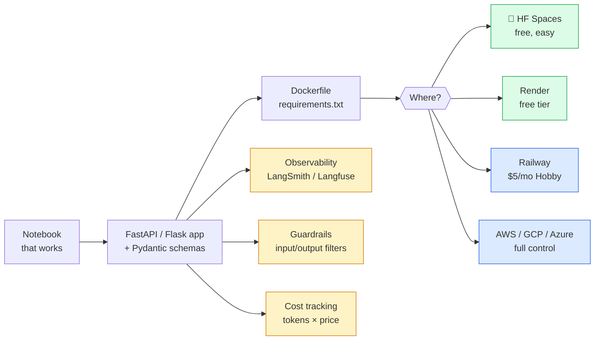
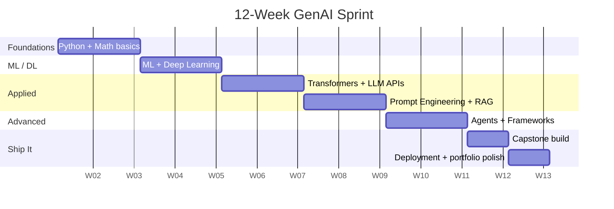

# GenAI Roadmap for Juniors & Career Switchers

> A visual, no-fluff, beginner-first roadmap to break into **Generative AI** — built for students, juniors, and professionals shifting their career into GenAI.

This repo answers one question: **"I'm new — what do I actually need to learn, in what order, and how do I prove I learned it?"** No 100-hour course lists, no theory marathons. Just the essentials, sequenced, with a hands-on notebook for every concept.

- **Live site:** https://purnendu-das-in.github.io/genai-roadmap-for-juniors/
- **Hands-on notebook:** [Python Code Samples.ipynb](Python%20Code%20Samples.ipynb) — 9 sections, ~6 hours, runs free in [Google Colab](https://colab.research.google.com/).

---

## The whole journey at a glance

> **Rule of thumb:** if you've already worked as a software engineer, you can skim Stages 0–4 and start at **Stage 5**. If you're brand new, start at Stage 0 and don't skip.

---

## How to use this roadmap

1. **Go in order.** Each stage builds on the previous — skipping creates fragile knowledge.
2. **Aim for working understanding, not perfection.** You'll deepen as you build.
3. **Code beats theory.** Build the listed mini-project at the end of each stage.
4. **Time-box.** If a stage takes more than 1.5× the suggested time, simplify and move on. Come back later.
5. **Keep one notebook open.** Open [Python Code Samples.ipynb](Python%20Code%20Samples.ipynb) in Colab and run cells as you progress.

---

## The roadmap

### Stage 0 — Mindset & Setup *(1–2 hours)*
- **What GenAI actually is:** statistical models that generate **tokens** (text), pixels (images), samples (audio), or actions. They predict what comes next given context — they don't "understand" or "look things up" by default.
- **Install:** Python 3.10+, VS Code, Git, a GitHub account.
- **Learn:** the command line, virtual environments (`venv` or `conda`), and basic Git (`clone`, `commit`, `push`, `pull`, `branch`).
- **Sign up (free tiers):**
  - [Google AI Studio](https://aistudio.google.com/) — most generous free tier as of 2026, recommended for beginners.
  - [Hugging Face](https://huggingface.co/) — for open-weight models, datasets, free hosting.
  - One of: [OpenAI](https://platform.openai.com/), [Anthropic](https://console.anthropic.com/) — paid, but tiny credits go a long way.
- **Mini-deliverable:** push a "hello world" Python repo to GitHub. Run it on your machine. That's it.

### Stage 1 — Python Essentials *(1–2 weeks)*
- Variables, types, control flow, functions, classes.
- Working with **files**, **JSON**, and **HTTP APIs** (`requests`).
- Libraries to know: `numpy` (arrays), `pandas` (tables), `matplotlib` (plots).
- Exception handling, list/dict comprehensions, f-strings, type hints.
- **Mini-deliverable:** write a script that reads a CSV, computes something, calls a public API, and writes the result to JSON. ~50 lines.

### Stage 2 — Math (Just Enough) *(2–4 days)*
You don't need a math degree. You need **intuition**.
- **Linear algebra:** vectors, matrices, dot products, what "similarity" means geometrically.
- **Probability:** distributions, expectation, why softmax exists.
- **Calculus:** what a gradient is and why "going downhill" trains a model.
- **Goal:** read a paper's diagram and not feel lost. That's it.

### Stage 3 — Machine Learning Foundations *(1 week)*
- Supervised vs unsupervised vs reinforcement learning.
- Train/validation/test splits, **overfitting**, **bias-variance tradeoff**.
- Evaluation metrics: accuracy, precision, recall, F1, MSE, perplexity.
- Use **scikit-learn** on a small tabular dataset (Iris, Titanic) to feel the workflow.
- Understand **a neuron** → forward pass → loss → backprop → gradient descent. Karpathy's *micrograd* is the gold standard.

### Stage 4 — Deep Learning Basics *(1–2 weeks)*
- Tensors, layers, activations (ReLU, GELU), loss functions, optimizers (SGD, Adam).
- Pick **one** framework — **PyTorch** (recommended; what every modern paper uses) **or** Keras.
- Build end-to-end:
  - A tiny **MLP** for MNIST.
  - A small **CNN** for CIFAR-10.
  - A character-level **RNN/Transformer** for text generation.
- **Mini-deliverable:** train a network that beats random on a real dataset, saved as a notebook with charts.

### Stage 5 — NLP & Transformers *(1 week)*
This is where GenAI starts.

- **Tokenization:** how text becomes numbers (BPE, SentencePiece). Words ≠ tokens.
- **Embeddings:** vectors that capture meaning. Similar meaning → similar vectors.
- **Attention:** the mechanism that lets a model "look at" earlier tokens with different weights. Understand the *intuition*, not the matrix algebra.
- **Encoder vs decoder vs encoder-decoder:** BERT (encoder, understanding), GPT/Llama/Claude (decoder, generation), T5/BART (both, translation/summarization).
- **Hands-on:** [Hugging Face Transformers](https://huggingface.co/docs/transformers) — load a model, run `pipeline(...)`, inspect outputs.

### Stage 6 — Large Language Models (LLMs) *(3–5 days)*
- **Pre-training** (predict next token on the internet) → **post-training** (instruction tuning + RLHF/DPO to make it useful and safe).
- **Open-weight vs closed:** Llama, Mistral, Qwen, DeepSeek, Gemma (open) vs GPT, Claude, Gemini (closed APIs).
- **Knobs you'll actually use:**
  - **Context window** — how much text the model can "see" at once (now 128K–2M tokens depending on model).
  - **Tokens** — billing unit and length unit. ~1 token ≈ 4 English characters or ¾ of a word.
  - **Temperature** — 0 = deterministic, 1 = creative, >1 = chaotic. Default 0.2–0.7.
  - **top-p / top-k** — alternative sampling controls. Stick with temperature unless you have a reason.
- **Hands-on:** call a hosted LLM (Gemini API in the notebook), then run a small open model locally with [Ollama](https://ollama.com/) or `transformers`.

### Stage 7 — Prompt Engineering *(3–5 days)*
- **Zero-shot, few-shot, chain-of-thought.**
- **Roles:** `system` (rules), `user` (input), `assistant` (response). Use them.
- **Structured output:** ask for JSON; better, use the model's *structured-output* mode (`response_format`, `with_structured_output`, etc.). Validate with **Pydantic**.
- **Function / tool calling:** the model returns *which function to call* with *what arguments*; your code runs it and feeds the result back.
- **Pitfalls:** **hallucinations** (confidently wrong), **prompt injection** (user input overrides system rules), **context drift** in long chats.

> **Always try in this order: Prompt → RAG → Fine-tune.** Each step costs 10–100× more effort than the previous. Don't skip ahead.

### Stage 8 — RAG (Retrieval-Augmented Generation) *(1 week)*

- **Why RAG:** LLMs don't know your data and have a knowledge cutoff. RAG injects relevant snippets into the prompt at query time.
- **Embeddings & vector DBs:** FAISS (local, free), Chroma (local + simple), Qdrant (production OSS), Pinecone (managed).
- **Chunking:** start with `RecursiveCharacterTextSplitter`, ~500 tokens, ~50 overlap. Tune later.
- **Re-ranking:** add a cross-encoder (e.g. `bge-reranker`) on top-20 → top-3 for big quality wins.
- **Mini-deliverable:** **"Chat with your PDF"** — upload a PDF, ask questions, get cited answers. (Section 6 of the notebook.)

### Stage 9 — Frameworks & Tooling *(1 week)*
- **Orchestration:** **LangChain** (broadest) or **LlamaIndex** (RAG-first). Pick one. Both are fine.
- **Validation:** **Pydantic** v2 — your defense against malformed LLM output.
- **UIs in <50 lines:** **Gradio** (great for ML demos) or **Streamlit** (great for dashboards).
- **Observability:** **LangSmith**, **Langfuse**, or **Phoenix** — see every prompt, response, and tool call.
- **Experiment tracking (optional):** Weights & Biases, MLflow.

### Stage 10 — Agents & Multi-step Workflows *(1–2 weeks)*

- **Agent = LLM + tools + memory + a loop.** The **ReAct** pattern (Reason → Act → Observe → repeat) is the foundation.
- **Tool use / function calling:** the LLM emits a JSON call; your runtime executes it and returns the result.
- **Frameworks:** **LangGraph** (graphs, controllable, recommended), **CrewAI** (role-based), **AutoGen** (multi-agent chat), **OpenAI Agents SDK**.
- **Watch out for:** infinite loops (always cap iterations), runaway costs (log every call), bad tools (a flaky tool poisons the whole agent).
- **Mini-deliverable:** a research agent that takes a question, searches the web (or your KB), and writes a 1-page report.

### Stage 11 — Fine-tuning & Customization *(Optional but powerful)*
**Use this when prompting + RAG genuinely cannot get you there** — usually for *style*, *tone*, *domain language*, or *strict format adherence*, not for adding facts.
- **LoRA / QLoRA** — train a small "adapter" instead of the full model. Runs on a single consumer GPU.
- **Datasets:** quality > quantity. 500 hand-curated examples beat 50,000 noisy ones.
- **Evaluation:** build an eval set *before* you fine-tune. If you can't measure it, you can't improve it.
- **Tools:** Hugging Face `peft` + `trl`, [Unsloth](https://github.com/unslothai/unsloth), [Axolotl](https://github.com/OpenAccess-AI-Collective/axolotl).

### Stage 12 — Deployment & Productionization *(1 week)*

- Wrap your model in **FastAPI**. Validate input/output with **Pydantic**.
- Containerize with **Docker** so it runs the same everywhere.
- Free / cheap hosting: **Hugging Face Spaces** (free GPU on a queue), **Render** (free web service tier), **Railway** ($5/mo Hobby).
- **Don't ship without:** logging, error handling, rate limiting, a kill-switch, a per-request token-cost log.

### Stage 13 — Responsible AI *(ongoing)*
Not a stage you "finish" — it's a lens for everything above.
- **Hallucinations:** assume they happen. Cite sources, validate, add a confidence step.
- **Prompt injection / jailbreaks:** treat user input as *untrusted*. Never let it override system instructions for sensitive actions.
- **Data leakage:** don't send PII, secrets, or proprietary data to third-party APIs without consent. Use a self-hosted model when in doubt.
- **Bias & fairness:** test across demographics; don't assume "default" outputs are neutral.
- **Evals & guardrails:** [Ragas](https://github.com/explodinggradients/ragas) for RAG, [DeepEval](https://github.com/confident-ai/deepeval), [Guardrails AI](https://github.com/guardrails-ai/guardrails), [NeMo Guardrails](https://github.com/NVIDIA/NeMo-Guardrails).

---

## Minimal toolkit (one row = one decision)

| Area | Pick this | Why |
|---|---|---|
| Language | Python 3.10+ | Every GenAI library lives here |
| DL framework | PyTorch | What modern papers and HF use |
| LLM API (free) | Google Gemini API | Most generous free tier in 2026 |
| LLM library (open) | 🤗 Transformers | Standard for any open model |
| Local model runner | Ollama | One command to run Llama / Qwen / Gemma |
| Orchestration | LangChain *or* LlamaIndex | Pick one and commit |
| Vector DB (start) | FAISS *or* Chroma | Local, free, zero ops |
| UI prototype | Gradio *or* Streamlit | Demo in < 50 lines |
| Validation | Pydantic v2 | Stops malformed JSON from breaking prod |
| Agent framework | LangGraph | Most controllable; pairs with LangChain |
| Observability | LangSmith *or* Langfuse | See every prompt + response |
| Deployment | Docker + HF Spaces | Free, fast, public URL |

---

## What does this actually cost? *(real numbers)*

For a learner doing the whole notebook end-to-end:

| Provider | Tier | What you can do |
|---|---|---|
| **Google AI Studio (Gemini)** | Free | Run all notebook examples. Daily request limits but plenty for learning. |
| **OpenAI** | $5 credit | ~5 million input tokens on `gpt-4o-mini`. Lasts most learners weeks. |
| **Anthropic Claude** | $5 credit | Similar — burnable on Haiku tier. |
| **Hugging Face** | Free | Datasets, model downloads, Spaces hosting (CPU). |
| **Ollama (local)** | Free | Runs on your laptop. 8GB RAM = 7B-parameter model territory. |

> **Beginner play:** start with Gemini's free tier + Ollama for local. You'll spend $0 through Stage 10.

---

## Project ideas (build these, in order)

1. **Smart Summarizer** — paste an article → get a 5-bullet summary. *(Stage 7)*
2. **AI Resume Reviewer** — upload resume → structured feedback (JSON via Pydantic). *(Stage 7)*
3. **Code Explainer Bot** — paste a function → get a beginner explanation. *(Stage 7)*
4. **Chat with your PDF** — RAG over a textbook or company handbook. *(Stage 8)*
5. **Mini Research Agent** — a goal in → a sourced report out. *(Stage 10)*
6. **Capstone:** something you'd actually use. A meal planner from your fridge photo. A journal that reflects with you. A study buddy that quizzes you from your own notes. **Personal > impressive.**

---

## Suggested 12-week plan

| Weeks | Focus | Deliverable |
|---|---|---|
| 1–2 | Python + Math basics | Public repo with 3 small scripts |
| 3–4 | ML + Deep Learning | Tiny image or text classifier |
| 5–6 | Transformers + LLM APIs | A "tool" using a hosted LLM |
| 7–8 | Prompt engineering + RAG | Chat-with-PDF deployed publicly |
| 9–10 | Agents + frameworks | A small agent with 2–3 tools |
| 11 | Capstone build | One project you'd genuinely use |
| 12 | Deployment + polish | README, demo video, blog post |

---

## Common beginner mistakes (avoid these)

1. **Tutorial loop.** You finish 12 courses and have nothing on GitHub. Build first; learn while building.
2. **Jumping to fine-tuning.** 95% of "fine-tuning" tasks are actually RAG or prompt problems.
3. **Skipping evaluation.** "It looked good in 3 examples" isn't a result. Build a 20–50 example eval set early.
4. **Ignoring tokens.** Tokens are time, money, and quality. Always log them.
5. **Trusting LLM output blindly.** Validate JSON. Verify facts. Treat it like a junior engineer who's confident but new.
6. **Over-frameworking.** LangChain/LangGraph are great when you need them. For a 30-line script, plain `requests` + the SDK is fine.
7. **Building in secret.** Tweet your progress, push half-finished repos, write up what you broke. The portfolio *is* the credential.

---

## Free resources (curated, ranked)

- **[Andrej Karpathy — Neural Networks: Zero to Hero](https://www.youtube.com/playlist?list=PLAqhIrjkxbuWI23v9cThsA9GvCAUhRvKZ)** — best deep-learning video series ever made.
- **[Hugging Face NLP Course](https://huggingface.co/learn/nlp-course)** + **[LLM Course](https://huggingface.co/learn/llm-course)** — practical, free, modern.
- **[DeepLearning.AI short courses](https://www.deeplearning.ai/short-courses/)** — 1-hour dives on Prompting, RAG, LangChain, Agents.
- **[fast.ai — Practical Deep Learning for Coders](https://course.fast.ai/)** — top-down, very fast progress.
- **[Full Stack Deep Learning](https://fullstackdeeplearning.com/)** — production-grade systems.
- **[Anthropic Cookbook](https://github.com/anthropics/anthropic-cookbook)** + **[OpenAI Cookbook](https://github.com/openai/openai-cookbook)** — copy-pasteable patterns.

---

## Glossary (for absolute beginners)

| Term | One-line meaning |
|---|---|
| **Token** | The chunk of text the model actually sees. ~4 characters or ¾ of a word. |
| **Context window** | How many tokens the model can read at once (input + output combined). |
| **Embedding** | A vector that represents meaning. Two similar sentences → two close vectors. |
| **Vector DB** | A database that stores embeddings and finds nearest neighbors fast. |
| **Temperature** | Randomness knob. 0 = same answer every time, 1 = creative. |
| **System prompt** | Persistent instructions the model follows for the whole conversation. |
| **Hallucination** | Confident-sounding but wrong output. Mitigate with RAG + citations. |
| **RAG** | "Look it up in my docs, then answer using what you found." |
| **Fine-tuning** | Updating the model's weights on your data — usually a small LoRA adapter. |
| **Agent** | An LLM that can choose to call tools in a loop until a goal is met. |
| **Tool / function calling** | The LLM emits a JSON call; your code runs it; the result goes back. |
| **Prompt injection** | A user smuggling instructions into your prompt to override system rules. |
| **Inference** | Running the model to get a result (vs. training, which builds the model). |

---

## Contributing

Found something missing, wrong, or out-of-date? PRs and issues are very welcome — this roadmap is meant to evolve with the field.

If you used this and got a job / built something cool, **open an issue and tell us**. We'll feature it.

---

⭐ **If this helped you, star the repo so the next beginner finds it.**
